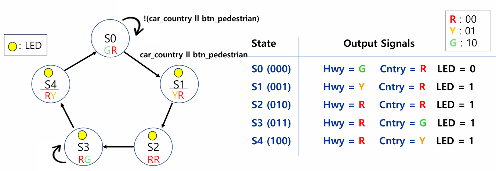
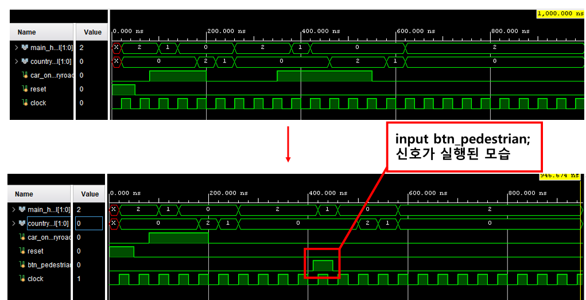
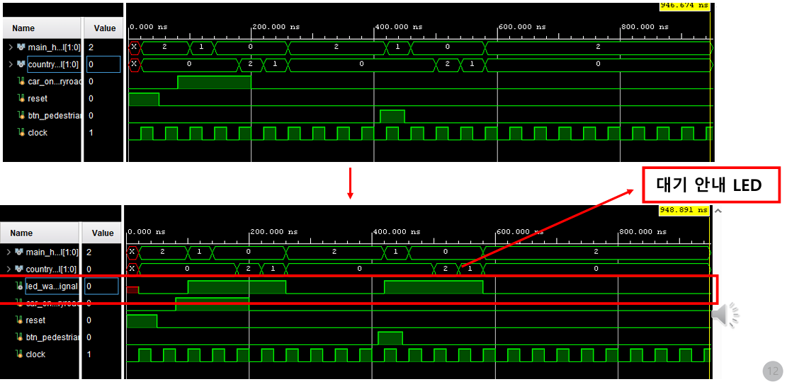

# Digital Logic Circuit Project: Traffic Signal Controller Enhancement

### Objective: Improving Intersection Safety through Pedestrian-Centered Logic Design
This project focuses on enhancing an existing Traffic Signal Controller system to support pedestrian crossing requests and real-time visual feedback using Verilog HDL and FPGA-based design.

---

## 1. Project Overview (과제 개요)

### 1.1 기존 시스템의 한계
* **차량 중심 설계:** 기존 컨트롤러는 메인 도로의 통행 흐름만을 우선시하여, 시골길(Country Road)에 차량이 감지될 때만 신호가 전환되는 폐쇄적인 구조였습니다.
* **보행자 접근성 결여:** 교차로 이용자 중 가장 취약한 보행자를 위한 신호 요청 인터페이스가 전혀 고려되지 않아 안전사고 발생 가능성이 존재했습니다.

### 1.2 기능 개선의 차별점 (Key Improvement)
* **논리적 효율성 극대화:** 본 프로젝트의 핵심은 기존에 구현된 FSM(Finite State Machine)의 복잡한 **State를 추가하거나 구조를 뒤엎지 않고**, 기존의 신호 전환 사이클을 그대로 활용한 점입니다.
* **입력 로직의 최적화:** 보행자 버튼 입력(`btn_pedestrian`)을 기존 차량 감지 센서(`car_country`) 신호와 OR 게이트로 결합하여, **보행자의 요청을 차량 진입과 동일한 우선순위의 제어 신호로 처리**하였습니다. 이를 통해 최소한의 수정으로 보행자 보호 기능을 완벽히 구현했습니다.
* **시각적 피드백 구현:** 보행자가 요청 접수 여부를 즉각 인지할 수 있도록 `led_wait` 신호를 추가하여 사용자 경험(UX)과 안전성을 동시에 확보했습니다.

---

## 2. Specification & State Machine (설계 사양 및 논리 구조)

* **Signal Logic:** Main Highway maintains GREEN by default. Country Road switches to GREEN only upon vehicle detection or pedestrian button input.
* **Wait Feedback:** When a request is made, the `led_wait` indicator turns on immediately to inform the pedestrian that the controller has processed the request.

> **[도표 1: State Machine Diagram]**
> 

---

## 3. Core Code Explanation (핵심 코드 설명)

The system was designed using Finite State Machine (FSM) logic. I added a register to handle the `btn_pedestrian` input and integrated it into the state transition logic via an OR gate configuration.

```verilog
// 보행자 버튼 입력 및 기존 차량 센서 신호를 OR 로직으로 결합
// 상태 전환의 추가 없이 기존 사이클을 그대로 활용하여 보행자 신호 요청 구현
always @(posedge clock or posedge reset) begin
    if (car_country || btn_pedestrian) 
        next_state <= S1; // 차량 혹은 보행자 입력 시 동일하게 신호 전환
end

// 보행자 버튼 입력 시 대기 LED 활성화 로직
S1: begin hwy = YELLOW; cntry = RED; led_wait = 1'b1; end
S2: begin hwy = RED;    cntry = RED; led_wait = 1'b1; end
```
## 4. Final Deliverables & Simulation (최종 결과물 및 시뮬레이션)

### 4.1 Simulation Results
* **Vehicle Entry Test:** Confirmed correct state transition (S0 → S1 → S2 → S3 → S4) when `car_country` signal is high.
* **Pedestrian Button Test:** Verified that `btn_pedestrian` triggers the same transition sequence as vehicle entry, ensuring pedestrian crossing capability without modifying the base logic.

> **[도표 2: Vivado Simulation 파형]**
> 
  

### 4.2 Conclusion
본 프로젝트를 통해 기존의 차량 중심 Traffic Signal Controller를 보행자 관점을 추가하여 개선하였으며, 불필요한 하드웨어 리소스 추가 없이 효율적인 논리 확장성을 검증했습니다.

* **[결과 보고서 (PDF)](디지털논리회로_기말프로젝트_결과보고서_송민호.pdf)**
* **[발표자료 (PDF)](디지털논리회로_기말프로젝트.pdf)**


